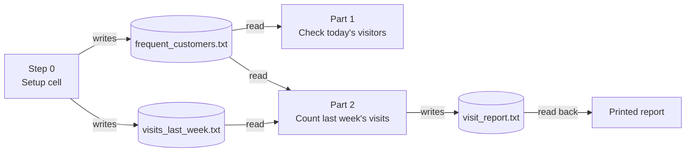
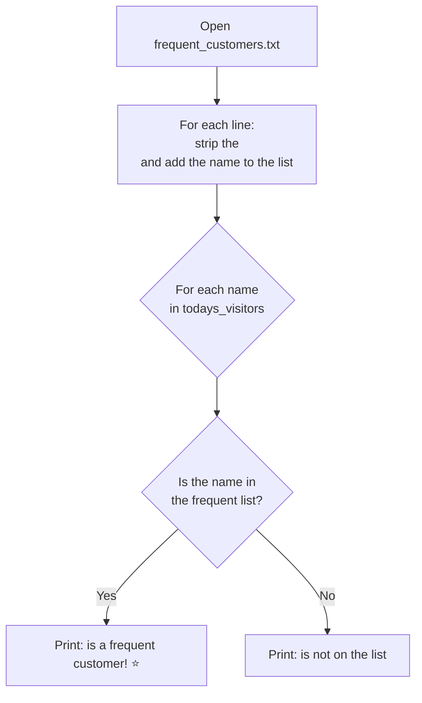
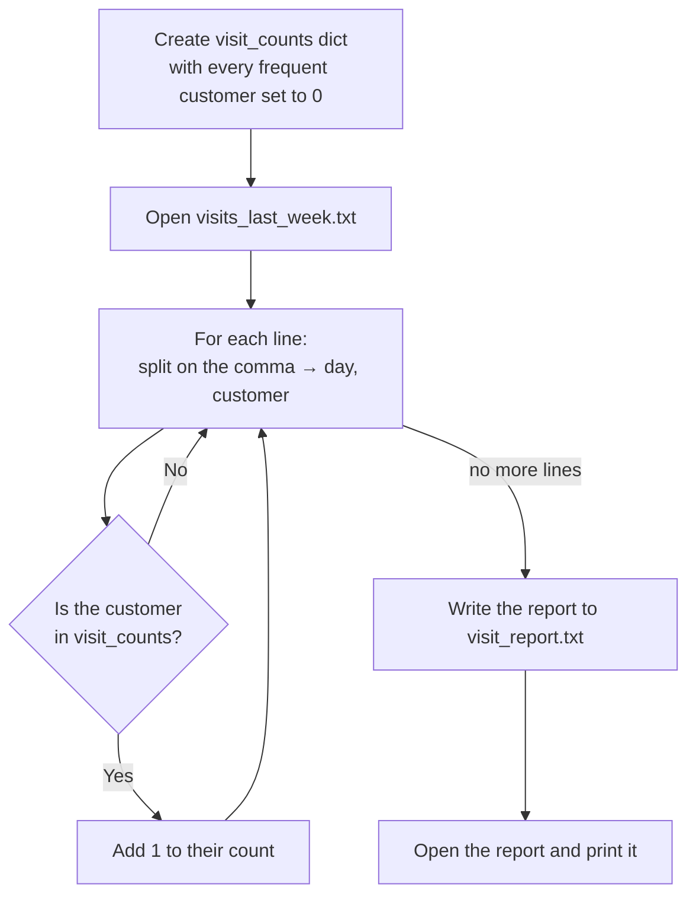
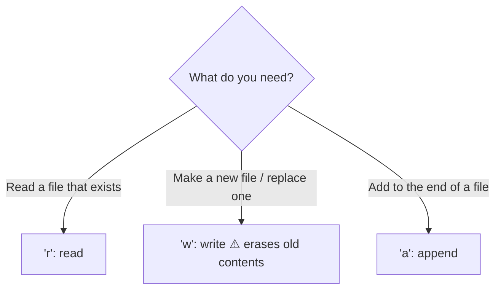

# ☕ Coffee Shop Regulars — Warm-Up Solution

Notebook: [`Warmup_Coffee_Shop_Solution.ipynb`](Warmup_Coffee_Shop_Solution.ipynb)

This notebook practices **reading and writing files** in Python. It answers two questions for the manager of Bean There Café:

1. Which of **today's visitors** are on the frequent customer list?
2. How many times did each **frequent customer** visit **last week**?

---

## How to run it

1. Open `Warmup_Coffee_Shop_Solution.ipynb` in Jupyter or VS Code.
2. Run the cells **from top to bottom**. The setup cell has to run first, because it creates the data files that the other cells read.
3. The output shows up under each cell, and a new file called `visit_report.txt` appears in the folder.

> ⚠️ The setup cell opens files in `"w"` (write) mode, which **erases** anything already in `frequent_customers.txt` and `visits_last_week.txt`.

---

## The big picture



---

## The files

| File | Created by | What's inside |
|---|---|---|
| `frequent_customers.txt` | Setup cell | One name per line (`Ana`, `Marcus`, ...) |
| `visits_last_week.txt` | Setup cell | One visit per line: `day,name` (e.g. `Monday,Ana`) |
| `visit_report.txt` | Part 2 | The final visit report |

---

## Part 1: Is this visitor a regular?

We read the frequent customer names into a list, then check each of today's visitors against it.



**Why `.strip()`?** Every line read from a file ends with `\n`, so `"Ana\n"` is not equal to `"Ana"`. Calling `.strip()` removes that newline.

---

## Part 2: The weekly visit report

We use a **dictionary** to count visits, with each name as a key and that customer's count as the value.



**Why start everyone at 0?** So a customer who never came in (like Lena) still shows up in the report as `Lena: 0` instead of being left out.

Expected output:

```
Frequent Customer Visits - Last Week
------------------------------------
Ana: 4
Marcus: 3
Priya: 3
Diego: 1
Lena: 0
------------------------------------
Total visits: 11
```

---

## File modes cheat sheet



Tip: always use `with open(...) as file:`. It closes the file for you automatically, even if something goes wrong.
